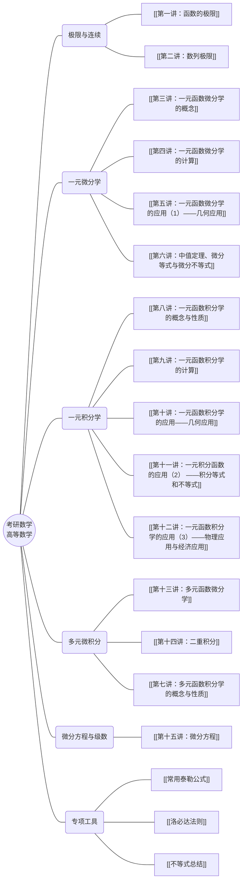

---
tags:
  - 考研数学/思维导图
  - 可视化
---

# 高等数学知识脉络图

> [!tip] 提示
> 本图采用 Mermaid 语法编写。在 Obsidian 中，你可以直接看到渲染后的思维导图。点击节点可跳转（如果开启了相关插件支持）或对照 [[知识导引]] 查阅。

---

## 核心逻辑链条

1. **极限** $\to$ **导数**：导数是增量比的极限。
2. **导数** $\to$ **微分**：微分是函数增量的线性主部。
3. **微分** $\to$ **积分**：积分是微分的逆运算（原函数）。
4. **一元** $\to$ **多元**：从直线到平面的微元法推广。

## 相关链接
- [[知识导引]]
- [[第六讲：中值定理、微分等式与微分不等式]]
