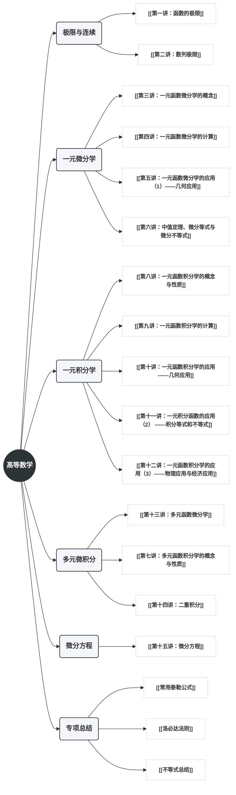

---
tags:
  - 考研数学/思维导图
  - 可视化
aliases:
  - 知识脉络图
---

# 高等数学知识脉络图

> [!important] 导读
> 本图采用 Mermaid 语法绘制，旨在构建高等数学全景知识体系。整体采用**纯右向横向单侧**结构，确保在移动端与桌面端均能获得清晰的阅读体验。

---

## 核心知识骨架

> [!tip] 逻辑链条
> 1. **极限** $\to$ **导数**：导数是增量比的极限，是微观变化的量度。
> 2. **导数** $\to$ **微分**：微分是函数增量的线性主部，实现“以直代曲”。
> 3. **微分** $\to$ **积分**：积分是微分的逆运算（原函数），实现从微观到宏观的累积。
> 4. **一元** $\to$ **多元**：从直线到平面的微元法推广，维度提升。

## 导航索引
- [[知识导引]]：查看详细的知识点清单。
- [[常用泰勒公式]]：高频使用的计算工具。
- [[第六讲：中值定理、微分等式与微分不等式]]：考研高分攻坚战。

